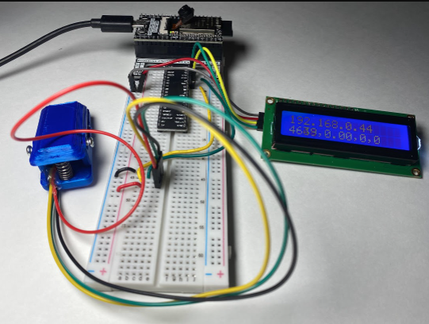
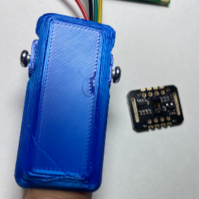
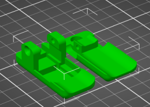
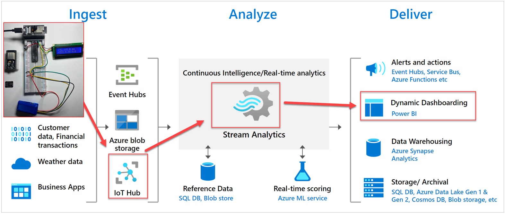
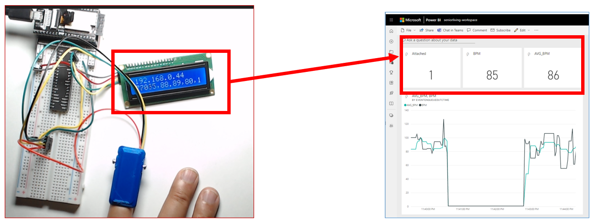

# heart-sensor-azure-iot 

This repository provides a sample ESP32 code how to collect a MAX30102 data and send the reading to Azure IoT Hub.

> **Please note**: The code for deployment of Azure and Power BI resources are not included here. This intent of this repository is to share the ESP32 code and its approach to send telemetry data to Azure IoT Hub (MQTT vs REST)


## The sketch
The ESP32 sketch consists of two IC components.

The VIN and GND of both I2C components are connected to the ESP32's VIN and GND. The I2C bus' SCL and SDL are connected as below

```
I2C SCL - > ESP32 Pin D22 (GIPO 22, Green cables in the images below) 
I2C SDA - > ESP32 Pin D21 (GIPO 21, Yellow cables in the images below) 
```




#### 1 - MAX30102 pulse oxidimetry and heart-rate monitor biosensor module:

The MAX30102 sensor accuracy depends on its stability and its IR sensor needs to be away from direct light. As such the sensor is mounted in Pulse Oximeter Finger Clip:  



The MAX30102 clip is 3D printed based on extended version of the following open 3D model from Thingiverse: 

https://www.thingiverse.com/thing:4395147



#### 2- Arduino Serial I2C 1602 16×2 Character LCD Module

The display shows the WIFI status, IP Address, and the current sensor reading. It is used for tracing and debugging propose, which is not essential for sending heartbeat telemetry data.

## Azure IoT Hub Setup


The following diagram depicts the Azure IoT setup:



#### Realtime Visualization
The completed work allows to track the MAX30102 reading realtime :




# Azure IoT Interface

The ESP32 code uses a simple HTTP Post REST call to send telemetry data to Azure IoT Hub. 

The file `iot-hub-rest/iotpost.http` provides a working example how to make the HTTP POST call:

```
POST {{iot-hub-rest-uri}}
Authorization: {{sas-token}}
Content-Type:  application/json

{
 "bpm": 98,
 "avg_bpm" : 93
}

```


> The `iotpost.http` file can be processed and execute by the [REST Client](https://marketplace.visualstudio.com/items?itemName=humao.rest-client) Visual Studio Code extension.

The following Arduino sketch code sends the POST call to Azure IoT Hub:

```
HTTPClient http;

String request = "https://" + String(IOT_HUB_NAME) + ".azure-devices.net/devices/" + String(DEVICE_ID) + "/messages/events?api-version=2018-04-01";
Serial.print("Sending WIFI: ");
Serial.print(request);
Serial.print(jsonPayload);
Serial.print(" -> Result: ");
http.begin(request);
http.addHeader("Content-Type", "application/json");
http.addHeader("Authorization", SAS_TOKEN);
int httpStatus = http.POST(jsonPayload);
response = http.getString();
Serial.println(httpStatus);
http.end();
```

The HTTP Post REST call is the The **Send Device Event**. While it is documented [here](https://learn.microsoft.com/en-us/rest/api/iothub/device/send-device-event), the `iotpost.http` example deciphers a few details to successfully make the call. 

The following Azure CLI command shows/traces the events being submitted by the ESP32 code or any devices. It is quite helpful for debugging or diagnosing issues with malformed REST calls.

```
az iot hub monitor-events --output table --hub-name {name} --output yaml
```


#### Options for generating per-device SAS tokens

There are a few options to get a per-device SAS tokens including the following:

1. Azure CLI: https://learn.microsoft.com/en-us/cli/azure/iot/hub?view=azure-cli-latest#az-iot-hub-generate-sas-token
1. Azure IoT tools for Visual Studio Code: https://marketplace.visualstudio.com/items?itemName=vsciot-vscode.azure-iot-tools
1. Azure IoT explorer https://learn.microsoft.com/en-us/azure/iot-fundamentals/howto-use-iot-explorer


# Next steps for extending this idea:

1. MAX30102 sensor can sense blood oxygen level and body temperature.
1. The noise cancellation algorithm can improve by leveraging the Azure Stream Analytics stream data processing power.
1. Anomaly detection and alerts.


